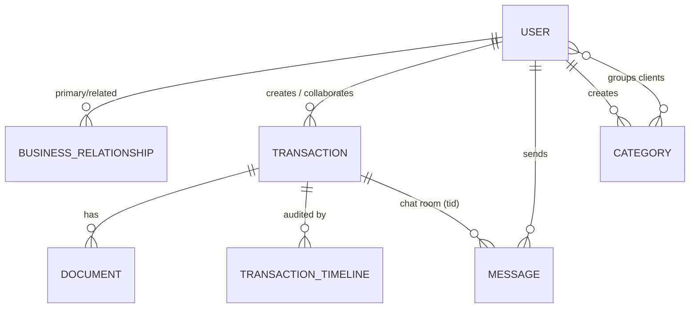

# HisaabKitaab — Backend API Server

> The core REST + WebSocket API powering [hisaabkitaab.ai](https://hisaabkitaab.ai) — a collaborative B2B transaction ledger where businesses create transactions, share documents, chat in real time, and get AI-powered transaction intelligence.

**Author:** Chandan Pandey
**Copyright:** © hisaabkitaab.ai — All rights reserved.

---

## Table of Contents

- [Overview](#overview)
- [Tech Stack](#tech-stack)
- [Project Structure](#project-structure)
- [Database Entities & Relations](#database-entities--relations)
- [API Reference](#api-reference)
- [Real-Time Chat (Socket.IO)](#real-time-chat-socketio)
- [AI Service Integration](#ai-service-integration)
- [Middleware Pipeline](#middleware-pipeline)
- [Email System](#email-system)
- [Environment Variables](#environment-variables)
- [Local Setup](#local-setup)
- [Docker](#docker)
- [Testing](#testing)
- [Deployment (CI/CD)](#deployment-cicd)
- [Logging & Error Handling](#logging--error-handling)

---

## Overview

This service is the system of record for HisaabKitaab. It owns:

- **Authentication** — email/password auth with OTP email verification, JWT (httpOnly cookie) sessions, password reset flows, and OTP-based email authorization for external (non-registered) collaborators.
- **Transactions** — the central domain object. A transaction has an owner, a creator, collaborators, documents, a verification workflow, and an activity timeline.
- **Documents** — multipart uploads streamed to **Amazon S3**, with metadata persisted in MongoDB.
- **Real-time chat** — per-transaction chat rooms over **Socket.IO**, persisted to MongoDB.
- **AI event publishing** — every meaningful transaction event (creation, document upload, new message, verification) publishes an ingestion event to **Amazon SQS**, which the [AI service](../hisaabkitaab-ai-service/README.md) consumes to keep its RAG knowledge base fresh.
- **Transactional email** — templated HTML emails via **Amazon SES** (welcome, OTP, transaction notifications, completion notices, password resets).

## Tech Stack

| Concern | Technology |
|---|---|
| Runtime | Node.js 20 (ES Modules) |
| Framework | Express 4 |
| Database | MongoDB (Mongoose 9 ODM) |
| Real-time | Socket.IO 4 |
| Auth | JSON Web Tokens (`jsonwebtoken`), bcryptjs, httpOnly cookies |
| File storage | Amazon S3 (`@aws-sdk/client-s3`, `@aws-sdk/lib-storage`, Multer memory storage) |
| Messaging | Amazon SQS (`@aws-sdk/client-sqs`) — ingestion events for the AI service |
| Email | Amazon SES (`@aws-sdk/client-ses`) + Handlebars HTML templates |
| OCR (available) | Amazon Textract (`@aws-sdk/client-textract`) |
| PDF generation | PDFKit |
| Security | Helmet, CORS allowlist, express-rate-limit |
| Logging | Winston (file transports under `logs/`), Morgan (HTTP access logs) |
| Testing | Jest + Supertest (Babel for ESM transform) |
| Containerization | Docker, Docker Compose |
| CI/CD | GitHub Actions → SSH deploy to AWS EC2 |

## Project Structure

```
hisaabkitaab-backend/
├── app.js                        # App entrypoint: Express app, middleware, routes, HTTP + Socket.IO server
├── config/
│   ├── db.connection.js          # MongoDB connection (Mongoose)
│   ├── config.sqs.js             # AWS SQS client
│   ├── config.ses.js             # AWS SES client config
│   └── constants.js              # Shared constants
├── controllers/
│   ├── controller.user.js        # Register, login, OTP verify/resend, password reset, email authorization
│   ├── controller.profile.js     # Get / update / delete user profile
│   ├── controller.transaction.js # Transaction CRUD, S3 uploads, verification, metrics
│   ├── controller.timeline.js    # Transaction timeline (audit trail) entries
│   ├── controller.category.js    # Client categories (grouping)
│   ├── controller.relation.js    # Business relationships (user ↔ client links)
│   ├── controller.chats.js       # Fetch chat history per transaction
│   └── controller.ai.js          # AI bridge: SQS ingestion publisher + /ask proxy to AI service
├── middlewares/
│   ├── middleware.auth.js        # JWT auth (cookie or Bearer), token validation
│   ├── middleware.error.js       # Global error handler
│   ├── middleware.multer.js      # Multer memory storage for multipart uploads
│   └── middleware.rateLimit.js   # API-wide + forgot-password rate limiters
├── models/
│   ├── model.user.js             # User + BusinessRelationship schemas
│   ├── model.transaction.js      # Transaction + TransactionTimeline schemas
│   ├── model.document.js         # Document (file metadata) schema
│   ├── model.message.js          # Chat message schema
│   ├── model.categories.js       # Category schema
│   └── model.activity.js         # Generic activity log schema
├── routes/
│   ├── route.user.js             # /api/users — auth, profile, clients, categories, transactions, timeline
│   ├── route.transaction.js      # /api/transactions — list, upload
│   └── route.chat.js             # /api/chats — chat history + AI ask proxy
├── services/
│   ├── service.s3.js             # Upload/delete objects in S3
│   ├── service.publish-sqs.js    # Publish ingestion events to SQS
│   ├── service.emailService.js   # SES + Handlebars templated email sender
│   ├── service.mailling.js       # (legacy) Nodemailer sender
│   └── service.generatepdf.js    # PDF receipt generation (PDFKit)
├── socket/
│   └── index.js                  # Socket.IO server: rooms, message persistence, ingestion events
├── templates/                    # Handlebars HTML email templates
├── utils/
│   ├── logger.js                 # Winston logger
│   ├── generateOTP.js            # OTP generator
│   ├── generateTransactionId.js  # Unique transaction ID middleware
│   └── errorHandler.js           # Error helpers
├── tests/                        # Jest + Supertest test suites
├── Dockerfile
├── docker-compose.yaml
└── .github/workflows/deploy.yml  # CI/CD pipeline (EC2 deploy)
```

## Database Entities & Relations

All persistence is MongoDB via Mongoose. Collections and their relationships:

### Entity summary

| Model | Collection | Purpose |
|---|---|---|
| `User` | `users` | Registered business user (auth, profile, membership) |
| `BusinessRelationship` | `businessrelationships` | Directed link between two users (owner ↔ client) |
| `Transaction` | `transactions` | Core ledger entry with collaborators, documents, verification state |
| `TransactionTimeline` | `transactiontimelines` | Append-only audit trail per transaction |
| `Document` | `documents` | File metadata for S3 objects attached to a transaction |
| `Message` | `messages` | Chat message inside a transaction room |
| `Category` | `categories` | User-defined grouping of clients |
| `Activity` | `activities` | Generic user activity log |

### Field-level detail

**User**
`name`, `email` (unique), `companyName`, `address`, `password` (bcrypt hash), `gstNumber`, `isActive`, `emailVerified`, `otp` / `otpExpires`, `passwordResetToken` / `passwordResetExpires`, `membershipType` (`free` | `premium`), `profileImage`, timestamps.

**BusinessRelationship**
`primaryBusiness` → `User`, `relatedBusiness` → `User`, `isActive`, timestamps. Models the "my clients" list; queried from both directions.

**Transaction**
`transactionId` (unique business key, string — used across services), `ownerEmailId`, `createdBy` (email), `title`, `description`, `status` (`draft` | `inprogress` | `completed` | `cancelled`), `completedAt`, `collaborators[]` → `User`, `documents[]` → `Document`, `verifiedBy[]` (user IDs as strings), timestamps.

> A transaction auto-completes when every collaborator (plus the creator) has verified: `verifiedBy.length - 1 === collaborators.length`.

**TransactionTimeline**
`transactionId`, `action` (`created` | `updated` | `deleted` | `completed` | `cancelled` | `verified`), `timestamp`, `performedByUserId` → `User`.

**Document**
`transactionId`, `fileName`, `fileUrl` (S3 URL), `s3Key`, `bucket`, `fileType` (MIME), `uploadedBy` (name), `uploadedByUid`, timestamps.

**Message**
`tid` (transaction ID, indexed), `senderId` → `User`, `text`, timestamps.

**Category**
`name`, `categoryId` (unique), `createdBy` → `User`, `clients[]` → `User`, timestamps.

### Relationship diagram



> **Note:** cross-collection links to transactions use the string `transactionId` business key (not the Mongo `_id`), so the AI service and public share links can reference transactions without ObjectId coupling.

## API Reference

Base URL: `http://localhost:<PORT>` (default `5000`). All routes are rate-limited by `apiLimiter`.

### Auth & account — `/api/users`

| Method | Path | Auth | Description |
|---|---|---|---|
| POST | `/register` | — | Register user, send OTP verification email |
| POST | `/verify-otp` | — | Verify email OTP, activate account |
| POST | `/resend-otp` | — | Resend the verification OTP |
| POST | `/login` | — | Login; sets `token` httpOnly JWT cookie |
| POST | `/logout` | — | Clear session cookie |
| POST | `/forgot-password` | — (extra rate limit) | Send password-reset link |
| POST | `/reset-password/:token` | — | Reset password with emailed token |
| POST | `/validate-token` | cookie/JWT | Validate current session (used by frontend middleware) |
| GET | `/profile` | ✅ | Get authenticated user's profile |
| PUT | `/profile` | ✅ | Update profile |

### Clients & categories — `/api/users`

| Method | Path | Auth | Description |
|---|---|---|---|
| GET | `/clients` | ✅ | List business relationships (clients) |
| POST | `/clients` | ✅ | Add a client relationship |
| DELETE | `/clients` | ✅ | Remove a client relationship |
| GET | `/categories` | ✅ | List categories |
| POST | `/categories` | ✅ | Create category |
| DELETE | `/categories/:id` | ✅ | Delete category |

### Transactions — `/api/users`

| Method | Path | Auth | Description |
|---|---|---|---|
| GET | `/transaction` | ✅ | List transactions (created, owned, or collaborating) |
| GET | `/transaction/:id` | ✅ | Transaction detail + collaborators + verification state |
| POST | `/transaction` | ✅ | Create transaction (multipart: up to 5 documents → S3), notify collaborators by email, trigger AI `FULL_REBUILD` ingestion, init timeline |
| PATCH | `/transaction/:transactionId/details` | ✅ | Update title/description (owner/creator only) + timeline entry |
| POST | `/transaction/:id/verify` | ✅ | Verify transaction; auto-completes when all parties verified; triggers AI `VERIFICATION_UPDATE` ingestion |
| DELETE | `/transaction/:id` | ✅ | Delete transaction + documents (S3 + DB) + timeline |
| GET | `/timeline/:id` | ✅ | Get transaction timeline |
| GET | `/transaction/metrics/userdata` | ✅ | Dashboard metrics (transactions involved/pending, docs, clients) |

### Public transaction routes (external collaborators)

Used by the pre-authorize / share-link flow — auth via `view-refresh-token` cookie issued by email OTP authorization:

| Method | Path | Description |
|---|---|---|
| POST | `/transaction/authorize-email` | Send OTP to an invited (possibly unregistered) collaborator |
| POST | `/transaction/authorize-email/verify-otp` | Verify OTP, issue scoped view token |
| GET | `/transaction-view/:tid` | View transaction as authorized external user |
| GET | `/transaction/:id/documents` | List transaction documents |
| POST | `/transaction/:tid/pub/verify` | Verify as external collaborator |
| POST | `/transaction/:tid/documents` | Upload documents as external collaborator; triggers AI `DOCUMENT_UPLOADED` ingestion |

### Chats — `/api/chats`

| Method | Path | Auth | Description |
|---|---|---|---|
| GET | `/:tid` | ✅ | Chat history for a transaction |
| POST | `/ai/ask` | — (proxied) | Ask the AI assistant about a transaction — proxied to the AI service `/ask` with the internal API key |

### Misc

| Method | Path | Description |
|---|---|---|
| GET | `/health` | Health check (`200 Server is healthy`) |

## Real-Time Chat (Socket.IO)

Socket.IO is mounted on the same HTTP server at `/socket.io` (websocket + polling transports, CORS-allowlisted).

| Event | Direction | Payload | Behavior |
|---|---|---|---|
| `join_room` | client → server | `{ tid }` | Join the transaction's chat room |
| `send_message` | client → server | `{ tid, senderId, text }` | Persist `Message`, publish `MESSAGE_ADDED` ingestion event to SQS, broadcast to room |
| `receive_message` | server → room | populated `Message` | Delivered to everyone in the `tid` room |

## AI Service Integration

The backend talks to the AI service two ways (see [`controller.ai.js`](controllers/controller.ai.js)):

1. **Asynchronous ingestion (SQS, fire-and-forget)** — `publishIngestionEvent({ transactionId, ingestionReason })` sends a JSON message to `HK_SQS_INGESTION_QUEUE_URL`. Reasons emitted:
   - `FULL_REBUILD` — new transaction created
   - `DOCUMENT_UPLOADED` — new document(s) added
   - `MESSAGE_ADDED` — new chat message
   - `VERIFICATION_UPDATE` — a party verified the transaction
2. **Synchronous Q&A (HTTP)** — `POST ${HK_AI_SERVICE_URL}/ask` with header `x-internal-key: ${HK_INTERNAL_API_KEY}` and a 30s timeout. The reply is returned to the frontend as `{ reply }`.

## Middleware Pipeline

Request flow for a typical protected route:

```
CORS allowlist → Helmet → Morgan → JSON body (10kb limit) → cookie-parser
  → apiLimiter (rate limit)
  → authenticate / authenticateToken (JWT from cookie or Authorization: Bearer)
  → [route-specific: generateTransactionId → multer (memory) → uploadFilesToS3]
  → controller(s) (chained via next() for timeline updates)
  → globalErrorHandler
```

- `authenticate` — accepts `token` cookie **or** `Authorization: Bearer` header; loads `req.user`.
- `authenticateToken` — accepts `token` **or** `view-refresh-token` cookie (supports external collaborators).
- `forgotPasswordLimiter` — stricter limits on the password-reset endpoint.
- Uncaught exceptions / unhandled rejections are logged via Winston instead of crashing the process.

## Email System

`service.emailService.js` sends templated email through **Amazon SES**. Templates are Handlebars-compiled HTML in [`templates/`](templates/):

| Template | Trigger |
|---|---|
| `welcomeEmail.html` | Successful registration |
| `otpEmail.html` / `emailOtp.html` | OTP verification / external email authorization |
| `passwordResetEmail.html` | Forgot password |
| `resetPasswordSuccess.html` | Password reset confirmed |
| `transactionNotification.html` | Collaborator invited to a new transaction (includes pre-authorize link) |
| `collaborators-transaction-notification.html` | Collaborator notifications |
| `transactionCompletionEmail.html` | All parties verified — transaction completed |

Email broadcast is skipped when `NODE_ENV=development`.

## Environment Variables

Create a `.env` file in the project root (never commit it):

| Variable | Description |
|---|---|
| `PORT` | HTTP port (e.g. `5000`) |
| `NODE_ENV` | `development` / `production` |
| `MONGO_URI` | MongoDB connection string |
| `JWT_SECRET` | Secret for signing JWTs |
| `AWS_ACCESS_KEY` / `AWS_SECRET_KEY` | AWS credentials (S3) |
| `AWS_REGION` | AWS region for S3/SQS |
| `AWS_BUCKET_NAME` | S3 bucket for transaction documents |
| `HK_SQS_INGESTION_QUEUE_URL` | SQS queue URL for AI ingestion events |
| `AWS_SES_REGION` | SES region |
| `AWS_SES_FROM_EMAIL` | Verified SES sender address |
| `CLIENT_URL` / `CLIENT_URL_2` | Local/dev frontend origins (CORS allowlist) |
| `DEP_URL` / `DEP_URL_WWW` | Production frontend origins (CORS allowlist) |
| `HK_AI_SERVICE_URL` | Base URL of the AI service (e.g. `http://ai-service:8000`) |
| `HK_INTERNAL_API_KEY` | Shared secret sent as `x-internal-key` to the AI service |

## Local Setup

**Prerequisites:** Node.js ≥ 20, a MongoDB instance, AWS credentials with S3 + SQS + SES access.

```bash
# 1. Install dependencies
npm install

# 2. Configure environment
cp .env.example .env   # create and fill in the variables above

# 3. Start the dev server (nodemon, auto-reload)
npm start
```

The API is served at `http://localhost:5000` and Socket.IO at `http://localhost:5000/socket.io`.

## Docker

```bash
# Build and run (uses .env, exposes 5000, mounts ./logs)
docker compose up -d --build
```

The compose file attaches the container to the external `hisaab-net` network so it can reach the AI service container by name. Create it once with:

```bash
docker network create hisaab-net
```

## Testing

```bash
npm test        # Jest + Supertest (Babel transforms ESM)
```

Test suites live in [`tests/`](tests/).

## Deployment (CI/CD)

Pushes to `main` trigger [`.github/workflows/deploy.yml`](.github/workflows/deploy.yml):

1. SSH into the AWS EC2 host (secrets: `EC2_HOST`, `EC2_USER`, `EC2_KEY`).
2. `git pull origin main` in `~/hisaabkitaab-backend`.
3. `docker compose down && docker compose up -d --build` — zero-touch redeploy.

## Logging & Error Handling

- **Winston** writes structured logs to `logs/` (mounted as a Docker volume in production).
- **Morgan** (`dev` format) logs every HTTP request.
- A **global error handler** middleware is registered after all routes.
- Process-level `uncaughtException` / `unhandledRejection` handlers keep the server alive and log full stack traces.

---

## Related Documentation

- [ARCHITECTURE.md](ARCHITECTURE.md) — internal architecture of this service
- [System Architecture](../ARCHITECTURE.md) — how the backend, frontend, and AI service work together
- [AI Service README](../hisaabkitaab-ai-service/README.md)
- [Frontend README](../hisaabkitaab-frontend/README.md)

---

**Author:** Chandan Pandey · **© hisaabkitaab.ai** — All rights reserved.
